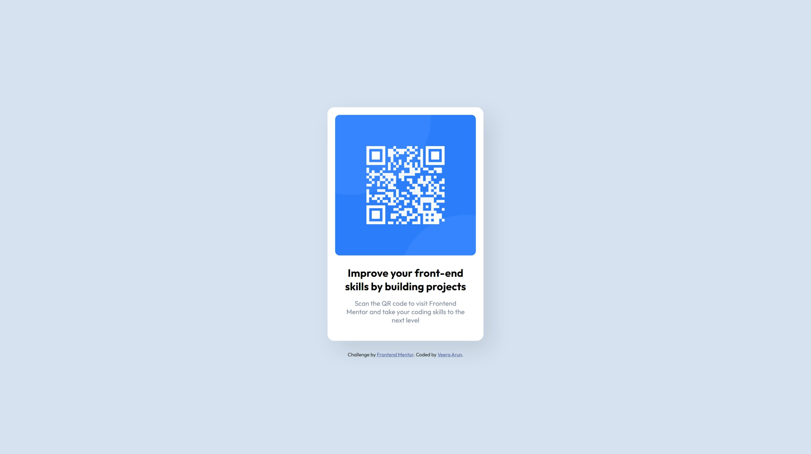

# Frontend Mentor - QR code component solution

This is a solution to the [QR code component challenge on Frontend Mentor](https://www.frontendmentor.io/challenges/qr-code-component-iux_sIO_H).

## Table of contents

- [Overview](#overview)
  - [Screenshot](#screenshot)
  - [Links](#links)
- [My process](#my-process)
  - [Built with](#built-with)
  - [Useful resources](#useful-resources)

## Overview

### Screenshot

### Links

- Solution URL: [https://www.frontendmentor.io/solutions/qr-code-component-ESDEFfhtsx]
- Live Site URL: [https://veeraarun.github.io/Frontend-Mentor_QR-code-component-solution/]

## My process

### Built with

- Semantic HTML5 markup
- CSS custom properties
- Flexbox

### Useful resource

(https://www.w3schools.com/css/css3_flexbox.asp) - This helped me for understanding flex. I really liked this pattern and will use it going forward.

